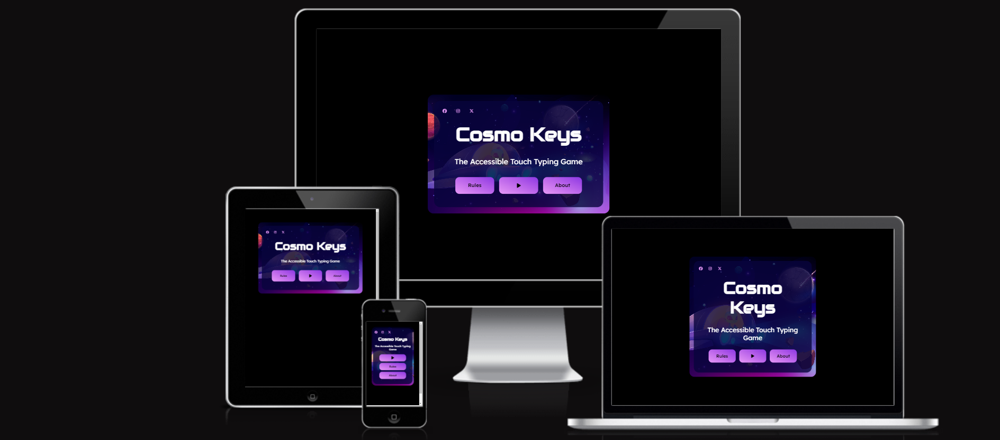

<h1 align="center">Cosmo Keys</h1>

<h2>

[View the live website here: Cosmo Keys](https://kosamad.github.io/Cosmo-Keys/)

</h2>

This is a typing game designed with visually impaired users in mind. Everything has been created to suit their needs  e.g colour choices, spoken elements and responsive functionality. However, it is also aimed to appeal to sighted users. It is a fun, interactive game with different levels of difficulty to accommodate different levels of skill.

<h2>Contents</h2>

xxxxxxx

<small><i><a href='http://ecotrust-canada.github.io/markdown-toc/'>Table of contents generated with markdown-toc</a></i></small>

---

## STRATERGY FOR THE WEBSITE

## User Experience (UX)

Using UX design principles, I outlined the key features a typing game would require and what a visually impaired (VI) user would require to ensure they could use the game.

### The Game's Features

- Clean, concise display pages with easy to find information (big buttons, high contrast etc)
- Compatibility with screen readers
- Simple game play that reads the target letter/words for the user
- Different levels of play

### User Stories

- #### Client Goals

1. To have clear, concice information that is easy to navigate and is accessible on multiple screen sizes and to those using screen readers.

2. To link to the games social media site and improve the webwise visibility of the .

3. To create a game that can be used by VI and sighted users with little differences in functionality. 

- #### First Time User Goals

   1. To be able to navigate the page without any difficulties inc using a screen reader or computer magnifyer.

   2. To be able to play the game succesfully.

   3. To be able to find the rules of the game and understand game play.

 #### Frequent/Return User Goals

  1. To be able to alter the level of difficulty that mathces current skill level. 

  2. To be able to quickly navigate to the game play page.

  3. To be able to follow the museum on a chosen social media platform.

  ---