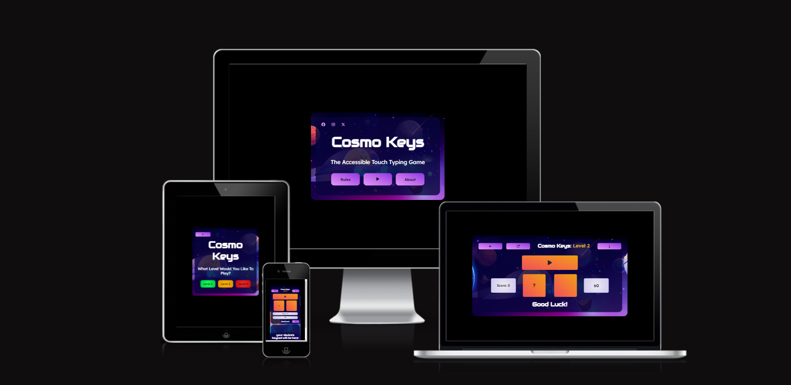
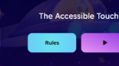
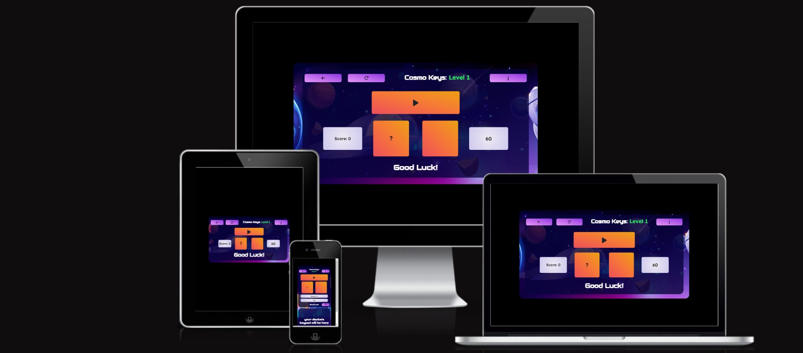

<h1 align="center">Cosmo Keys</h1>

<h2>

[View the live website here - Cosmo Keys](https://kosamad.github.io/Cosmo-Keys/)

</h2>

This is a typing game designed with visually impaired users in mind. Everything has been created to suit their needs  e.g colour choices, spoken elements and responsive functionality. However, it is also aimed to appeal to sighted users. It is a fun, interactive game with different levels of difficulty to accommodate different levels of skill.

<h2>Contents</h2>

xxxxxxx

<small><i><a href='http://ecotrust-canada.github.io/markdown-toc/'>Table of contents generated with markdown-toc</a></i></small>

---

## STRATERGY FOR THE WEBSITE

## User Experience (UX)

Using UX design principles, I outlined the key features a typing game would require and what a visually impaired (VI) user would require to ensure they could use the game.

### The Game's Features

- Clean, concise display pages with easy to find information (big buttons, high contrast etc)
- Compatibility with screen readers
- Simple game play that reads the target letter/words for the user
- Different levels of play

### User Stories

- #### Client Goals

1. To have clear, concice information that is easy to navigate and is accessible on multiple screen sizes and to those using screen readers.

2. To link to the games social media site and improve the visibility of the webwise.

3. To create a game that can be used by VI and sighted users with little differences in functionality. 

- #### First Time User Goals

   1. To play a game that allows a user (sighted or VI) to practise typing and get feedback for correct/incorrect answers. 

   2.  To be able to navigate the page without any difficulties inc using a screen reader or computer magnifyer.

   3. To be able to find the rules of the game and understand game play.

 - #### Frequent/Return User Goals

  1. To be able to alter the level of difficulty that mathces current skill level. 

  2. To be able to quickly navigate to the game play page.

  3. To be able to follow the museum on a chosen social media platform.

  ---

  ## SCOPE

  ### Opportunities Martix

The following opportunity matrix summarises the key features that could be implemented in the game Cosmo Keys. It outlines what was addressed in this roll out (phase 1) and what could be implemented in the future (phase 2).

#### Table 1 Opportunity Summary

|Opportunity                            |Importance|Viability|Score|
|:-------------------------------------:|:--------:|:-------:|:---:|
| Rules                                 | 5        | 5       | 10  |
| Information about the game/purpose    | 3        | 5       | 8   |
| Level selection                       | 5        | 3       | 8   |
| Volume control                        | 1        | 2       | 3   |
| Leaderboard                           | 2        | 3       | 5   |
| Contact form                          | 3        | 4       | 7   |
| Increase social media presence        | 3        | 5       | 8   |
| Level 1-3 play                        | 5        | 3       | 8   |
| Level 4-6 play +                      | 1        | 3       | 4   |
| Ability to pause the game             | 5        | 3       | 8   |

Based on the score, the opportunities were sumarised into their roll out phase. 

#### Table 2 Roll Out

|Opportunity                             | Phase for Roll Out|
|:-------------------------------------:|:-----------------:|
| Rules                                 | 1                 |
| Information about the game/purpose    | 1                 |
| Level selection                       | 1                 |
| Increase social media presence        | 1                 |
| Level 1-3 play                        | 1                 |
| Ability to pause the game             | 1                 |
| Contact form                          | 1/2**             |
| Volume control                        | 2                 |
| Leaderboard                           | 2                 |
| Level 4-6 play +                      | 2                 |

** I decided that for roll out 1 an email address could be displayed giving the user the ability to contact the game designers if they wanted to but that a contact form would be delayed until roll out 2. 

---

## STRUCTURE

The game will consist of an introductory page that allows the user to see the rules and about information. This will give context to why the game looks and functions as it does (i.e a platform for VI users to improve their typing accuracy). A button will move the user to level selection which will then take them forwards to the game play area.

As this is a game and not an informative website the pages will not take up the whole screen page, it will look like a game, taking up a position in the center of the users screen. Furthermore, it will have functionality and visuals that are typical of games. 

### Pages

1. Home (index) page

- Large, distinctive buttons.
- About and Instruction buttons pop up JS modal with relevant information. About inc contact information for the page (modals chosen to minimise the use of back buttons for VI users).
- Play button to take the user to level selection.
- Links to social media platforms (as not a real game, will just be to the home pages).

2. Level selection

- Colour relevant buttons which aid VI users to select a level of difficulty without having to read the words. Take the user straight to the game play page.
- Upper left “back” button takes you to the home page

3. Game play 

- A button which starts the game, giving the user the opportunity to look at the page before the  game starts.
- Buttons to pause the game, restart and move back to the level select page. This was chosen over a level-change button to minimise the amount of content a VI user needs to find in the game play area. 
- Rules modal in case a user needs to remind themselves how to play the game.
- A timer area.
- Score counter for correct answers.
- Boxes which display the computer’s challenge and the user's response.

  ---

### Wireframes

The following wireframes outline how the content will be viewed on different devices. They were created using balsamic.

1. 1 Home page (all devices)

    

1. 2 Home page example of how the modal will look

    

2. Level selection page (small screen)

    

    The level select page on other devices matches the home page layout.

3. 1 Game play page (small screen)

    

3. 2 Game play page (large screen)

    

Each page will be responsive and the user will be able to navigate between pages using the back button. There will be multiple opportunities for the user to interact with the page and play the game in a way that suits them. 

---

## SURFACE DESIGN

### Theme

I wanted the typing game to be fun for people of all ages. Space is a popular subject and there are lovely images and graphics that can be found to make the page engaging for everyone. Additionally and most importantly for my VI inspired game, space is dark! Which makes using contracting colours easy. They fit into the theme and are best for VI users to differentiate different parts of the screen. 

As a consequence of this subject I named the game "Cosmo Keys". Cosmo links to space and also implies speed, whilst Keys informs that the game is for typing (keys on a keyboard).

I found my background image on Freepik and used this for all subsequent design elements.

### Colour Scheme

From my background image I selected base, high contrasting colours using ColorZilla (purple #8a38e3, blue #70caf5, orange #f2624a) and created gradient backgrounds to use across my buttons using colourSpace.

Other colours were selected to complement these e.g the red, orange and green used on the level page. 

### Typography

The two fonts I have used for Cosmo Keys are from the Google font library. "Audiowide" was used for the title and impact words as it has a very game-like appearance and linked with my space theme. 

The more informative text was written using Lexend. This was selected after reading the article by google fonts titled ["Introducing accessibility in typography"](https://fonts.google.com/knowledge/readability_and_accessibility/introducing_accessibility_in_typography). It states that Lexend was designed to be easier to read, ensuring each character is distinctive from others.

### Sounds

The sounds for the "correct", "wrong" and "game-over" were selected from freesound. They are short, snappy sounds that don't take up too much time as part of the game and have distinctive tones which match a users expectations for right, wrong and the end of a game. 

To create the talk-back functionality of the game I used the Web Speech API created by Mozilla. 

### Features

The website is comprised of a home page, a level select page and a game play page.

All pages are responsive and have:

- A faviocon in the brower tab. This was generated by cropping the background image.

    

- A title which links back to the home page. 

- Buttons/links (and surrounding container) change colour when they are hovered over to a blue colour that is consistent through all the pages. 

    

- The back button for all pages will be positioned in the same, typical place (top left corner) to improve UX as this is where users expect a back button to be. 

#### The Home Page

 

The home page captivates the user with a distinctive and clean game-like imagery which has a container displaying the game's name (Cosmo Keys) and its key purpose, "The accessible touch typing game". There are links to the games social media platforms which additionally make the game feel more professional.  

 Below this there are three buttons which allow the user to:

 1. View the rules of the game or the "about” the game info. 
 
    Both of these display as modals to improve VI usability. The about modal tells the user that the game has been designed for VI users and gives the contact information for players to get in touch. The rules modal instructs the user how to play the game. For each, the user doen't need to find the "x" button and can simply click anywhere on the screen to exit.

      

 2. Move on to play the game (play button), and select the level of play.

#### The Level Selection Page

  

The game play for phase 1 roll out has three levels:

- Level 1 - 1 letter play
- Level 2 - 2 letter play
- Level 3 - 3 letter play

To aid VI users these are colour coordinated from green to red so a level can be selected based on colour (easier to see) than having to read the words with a magnifier.

#### The Game Play Page

  

This page is designed to make viewing it (on any device) easy for VI users. Therefore, whilst still being appealing to sighted users, there are some design elements which may have been modified if this was for sighted users only e.g the size of buttons/boxes are purposefully larger than needed and colour choices are more stark than they might otherwise be.

On small devices, initially the page appears on the small side, with a large black space at the bottom of the page, but this is to allow for the keyboard on a phone to be displayed, whilst all the other game aspects remain visible.

No keypad image:
 
   

With keypad once the game has started:

  

There are buttons which allow the user to reload the game (before a game has finished) or re-read the rules. This navigation-like bar at the top DOES NOT toggle to a burger on smaller devices. This was a conscious choice to aid VI users as these menus can be cumbersome (the screen reader reads out every option, every time it is selected).

The level that has been selected is displayed on the page, coloured to correspond to the level of difficulty.

During game play:

- To aid VI users the timer, which counts down from 60 to 0, has been designed to change colour as the time reduces, so a user doesn't have to read the numbers to know how long is left. This is done from green to red.

- Using a web speech API, each letter/word is read to the user. Additionally, at the end of the game the score is announced.

- Following a right or wrong answer a corresponding sound is played to improve UX for all users. I chose not to announce the players typed letter/word to improve how the game runs (even though this would help a user identify how they are going wrong). The score box increments with each correct answer. Additionally, there is a display that announces an answer as "right!" or "wrong!", improving UX for sighted users.

- The start game button turns into the pause button. This is to help VI users find it as often their display/mouse is left hovering over this element during game play.

### Future Roll Outs

This game could be developed in several areas in the future. Firstly I'd like to address the features that were outlined for [phase 2](#table-2-roll-out). This would be to add:

1. A separate area for a contact form.
2. The functionality to control the volume from the game it self, rather than relying on the device's controls.
3. Features that would allow the population of a leaderboard. e.g a username and then a page which would save and display.
4. Additional levels of increasing word  and the option to select symbol practice (something that is particularly difficult for VI users).

I would also address other issues that arose during the development of the game. There are:

1. To investigate and possibly implement an alternative talkback API as Web Speech is a little slow on level 2 play.

    The WebSpeech API does not allow you to trigger multiple Speech’s at once, i.e separate the two-letter array into its individual characters and then speak them “simultaneously”, but in reality use a timeout feature to separate their utterance by a few ms. This is something I would modify for the future. Putting in place a different API that allows for “simultaneous”speech or using audio files for each letter which will allow for parallel play.

2. Alter the use of the modal

    Modals were selected to limit the amount of page navigation a VI user would have to undertake (you can exit the rules modal by clicking anywhere). However, some screen readers recite everything underneath the modal before reading its content. This is a recognised issue for VI users and appears on the most commercial of website's (e.g the BBC). However, as this game is designed specifically for VI users this is a feature that shouldn't occur and therefore development of how the rules/about info is presented would be advantageous and would improve UX.

3. Re-design the page layout to make the buttons the total size of the container.

    On the computer this does not affect play as the hover classes tell the user when the button is selected. However, on a mobile, a player is likely to click anywhere in the container and expect the button to work. This should be corrected in future roll outs. 

  
### Accessibility

The accessibility of this game was a huge consideration throughout it's development. In addition to the design features already discussed (colour, contrast, size ets). I also ensured:

* Screen reader compadibility.
* Aria labelling to idenfiy different parts of the page.
* Semantic HTML.

Furthermore I checked the accesibility of my website using Google's [Web Disability Simulator](https://chromewebstore.google.com/detail/web-disability-simulator/olioanlbgbpmdlgjnnampnnlohigkjla?pli=1)

Here are two examples of how pages looked using the yellow/blue and red/green colour blindness filters.

I also tested the game using [Silktide's](https://chromewebstore.google.com/detail/mpobacholfblmnpnfbiomjkecoojakah) accesibilty extension for google chrome. Each page passed all checks for contrast and colour and could be read sucessfuly by a screen reader. Additionly, I got user feedback from a VI player.

## Technologies Used

### Languages

HTML, CSS and Javascript.

### Frameworks, Libraries, Programmes and Tools Used

- [Gitpod](https://gitpod.io/workspaces) and [Visual Studio Code Desktop Version](https://visualstudio.microsoft.com/#vscode-section) - to create the site (IDE's).
  
- [Balsamiq](https://balsamiq.com/) - to create wireframes.
  
- [Github](https://github.com/) - to save and store the files for the website.

- [Git](https://git-scm.com/) - for version control, using the Gittpod terminal to commit to Git and Push to GitHub.

- [Bootstrap version 5.3.2](https://getbootstrap.com/) - to input different features of the website including buttons and modals and to assist responsive styling.

- [Font Awesome:](https://fontawesome.com/) - to add icons and improve the UX.

- [Google Fonts](https://fonts.google.com/) - for the fonts used on the website.

- [ColorZilla](https://chromewebstore.google.com/detail/colorzilla/bhlhnicpbhignbdhedgjhgdocnmhomnp) - to pick colours from the background image and get hex codes.
  
- [Google Developer Tools](https://developer.chrome.com/docs/devtools/) - to veiw responsive styling and troubleshoot/solve issues.

- [Favicon.io](https://favicon.io/) - to create the Cosmo Keys favicon.

- [ColourSpace](https://mycolor.space/) - to create the colour gradients.

- [Am I Responsive?](http://ami.responsivedesign.is/) - to show the website on different devices/screen sizes.

- [Web Disability Simulator](https://chromewebstore.google.com/detail/web-disability-simulator/olioanlbgbpmdlgjnnampnnlohigkjla) - to view the website under different accesibiity filters.

[Silktide Accessibility Checker ](https://chromewebstore.google.com/detail/mpobacholfblmnpnfbiomjkecoojakah)  - to check the website for accesibiity and sample the screen reader function. 

- [GitHub Wiki Toc generator](https://ecotrust-canada.github.io/markdown-toc/) - to automatically create my contents page in the README.md file.

- [Web Speech API](https://developer.mozilla.org/en-US/docs/Web/API/Web_Speech_API) - by Mozilla to generate the talkback features of the game.

- [Datamuse API](https://www.datamuse.com/api/) - to generate words for level 2 and level 3 play.

## Testing

Please see the separate [testing](TESTING.md) file 

## Credit

### Content

### Media

- The only image used on this site was taken from Freepix, with specific credit to vectorpouch (<a href="http://www.freepik.com">Designed by vectorpouch / Freepik</a>)

- All sounds were selected from [Freesound](https://freesound.org/) with specfic credit to LittleRainySeasons for the "right" sound, Gronkjaer for the "wrong" sound and fupicat, for the final, game over sound. 

