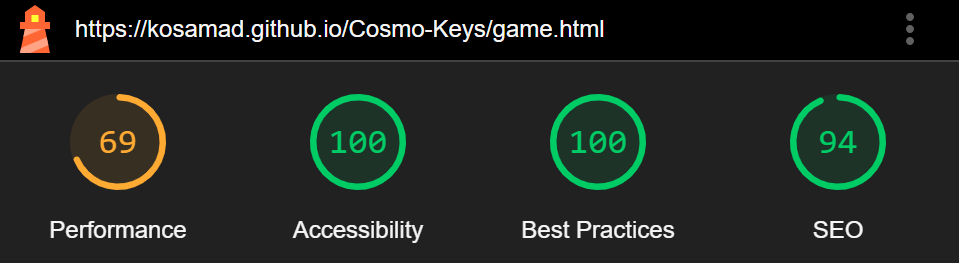

<h1 align="center">Cosmo Keys-Testing</h1>

[View the live website here - Cosmo Keys](https://kosamad.github.io/Cosmo-Keys/)

---

<h2>Contents</h2>

- [Automated Testing](#automated-testing)
  * [W3C Validator](#w3c-validator)
  * [JavaScript Validator](#javascript-validator)
  * [Lighthouse](#lighthouse)
  * [Jest](#jest)
- [Manual Testing](#manual-testing)
  * [User Stories](#user-stories)
    + [1. Client Goals](#1-client-goals)
    + [2. First Time User Goals](#2-first-time-user-goals)
    + [3. Frequent/Return User Goals](#3-frequent-return-user-goals)
    + [4. Real User Testing](#4-real-user-testing)
  * [Content Testing](#content-testing)
    + [Home Page Content](#home-page-content)
    + [Level Page Content](#level-page-content)
    + [Game Page Content](#game-page-content)
    + [Game Page Playing](#game-page-playing)

<small><i><a href='http://ecotrust-canada.github.io/markdown-toc/'>Table of contents generated with markdown-toc</a></i></small>

---

Whilst building the game, I continuously used Chrome developer tools to test my pages for responsiveness to different screen sizes and to troubleshoot any problems that arose, using a systematic approach to find and fix issues.

I specifically used the console to log and monitor javascript code which assisted me to problem solve aspects of the game which weren't working as expected.

---

## Automated Testing

### W3C Validator

[W3C](https://validator.w3.org/) was used to validate the HTML on each game page.

Please note that the error messages which relate to a "Trailing slash on void elements" have been filtered as they are automatically added by the browser and are not a true error (as advised by the CI tutors).

- [index.html](testing/images/validation/index.html-validated.PNG) - passed
- [level.html](testing/images/validation/level.html-validated.PNG) - passed
- [game.html](testing/images/validation/game.html-validated.PNG) - passed

CSS was validated using [W3C Jigsaw](https://jigsaw.w3.org/css-validator/validator).

- [style.css](testing/images/validation/css-validated.PNG) - passed

Please note, warnings relate to the vendor extensions and can be ignored.

---

### JavaScript Validator

[jshint](https://jshint.com/) was used to validate the JavaScript.

- [cosmo-index.js](testing/images/validation/index-js-valid.PNG) - passed
- [cosmo-level.js](testing/images/validation/level-js-valid.PNG) - passed
- [cosmo-game.js](testing/images/validation/game-js-valid.PNG) - passed

Please note, warnings relate the use of ES6 and are acceptable for the parameters of this project.

One unused variable is declared "playerAnswerContent". However, this is used in the game and removal of the variable at line 23 causes the game to break.
Additionally, jshint declares there are two undefined variables "SpeechSynthesisUtterance" and "speechSynthesis". However, declaring these variables outside of their function also causes the game to break.

---

### Lighthouse

Lighthouse (a Chrome Developer tool) was used to test the performance, quality and correctness of Cosmo Keys on a desktop.

All pages score poorly for performance. Improvements could be made by eliminating render-blocking resources caused from external styling and removing unused JavaScript (separating Bootstraps bundle). Also, separating my CSS into separate files to minimise what is loaded on each page (e.g the index page does not need the css for the game play page).

### Jest

I attempted to test the JavaScript elements of the game using Jest, an JavaScript automatic testing framework which ensures correctness of any JavaScript codebase. I managed to test a few variable and functions. However, the format of my JavaScript file did not seem to be compatible with advanced Jest testing. The following error message was logged for many elements, here shown for the pause button:

To remove this error I had to put my event listener into the function that waits for the DOM content to be loaded before filling the elements. However, by doing that I can no-longer test them using Jest. I additionally encountered numerous errors whilst attempting to use Jest which were extremely time consuming. After speaking with the CI tutors they advised me to pause Jest testing of my game and focus on the JavaScript itself. However this is a feature of JavaScript development that should be utilised in the future. With additional time and resources I would alter the way I structured my JavaScript to be compatible with testing.

My [Jest testing file](assets/js/tests/cosmo-game.test.js) is here. Please note to run you have to comment out the pause button event listener like so:

// document.getElementById("pause-btn").addEventListener("click", togglePause);

[This file](testing/jest/jest-attempts) shows some of the other methods I was using to try and test using Jest. I have kept it on file to show how I was approaching these problems. 

---

## Manual Testing

The website was viewed on Chrome, Internet Explorer, Microsoft Edge and Firefox to check the view was consistent between browsers. It was also viewed on a desktop, mobile (pixel5 and iphone13) and a Levona tablet.

### User Stories

#### 1. Client Goals

| Goal | How are they achieved? |
| :--- | :--- |
| To have clear, concise information that is easy to navigate and is accessible on multiple screen sizes and to those using screen readers.| Pages were designed to be minimalistic, with limited buttons for navigation/play ( i.e there is no traditional, website navigation bar/footer) and all were checked for responsive design.|
| To link to the games social media site and improve the visibility of the webwise.| Social media links were added on the title page |
| To create a game that can be used by VI and sighted users with little differences in functionality.| The design ensures compatibility with screen readers and uses audio elements that can be enjoyed by all users. Visually, the game is attractive no matter what level of vision a player has. Minor additions are present that would only be observed by a sighted user (e.g the "right/wrong" messages).|
---
---

#### 2. First Time User Goals

| Goal | How are they achieved? |
| :--- | :--- |
|I want to play a game to practise my typing. | Sounds are used to announce the letter/word and to give feedback on a right/wrong answer. A sound is played to announce the end of the game and the score is read out to the player.|
| I want to be able to navigate the page without any difficulties inc. using a screen reader or computer magnifier.| Screen-reader only classes with informative text were added to key parts of the page that display using icons (e.g the play button, reload button etc). This ensures a VI player can "see" what is on the page. |
| I want to be able to find the rules of the game and understand game play.| The rules and about the game are clearly displayed on the index page. The rules modal is also available on the game page if a user needs reminding of how to play. Both modals are designed to exit without having to find the "X". |
---
---

#### 3. Frequent/Return User Goals

| Goal | How are they achieved? |
| :--- | :--- |
|I want to be able to alter the level of difficulty that matches my current skill level.| A level selection page allows the user to start the game at a level that matches their skill set. Three levels have been designed within this roll out which gives a good level of variety for different users.|
|I want to be able to quickly navigate to the game play page.| The game was designed to lead the user to the game play page easily. The "play" buttons are always central to the screen. Furthermore, the rules/other information is hidden to eliminate the need to navigate these features for return users.|
---
---

#### 4. Real User Testing

The game was reviewed by friends and family. They were encouraged to comment on their user experience and feedback on any bugs they found. In each testing environment, users were asked to pay particular attention to the buttons and the overall look of the page. Particular checks were carried out by a VI player to document how they could play the game.

<u> Player feedback:</u>

- Three users (and my mentor) commented on the position of the game content when viewing on small devices. They didn't like the large black space at the bottom of the game play page. This was intentionally left to provide space for the keypad and ensure the whole game play area remained visible once the keypad appeared. However, as it was an issue for so many users I adapted the play screen to notify small screen users where their device keypad would be, and thus fill the space.  
   
     No keypad image:
 
    

     With keypad once the game has started:

     
        
-  One user said the position of the other page content could be better. Therefore on small devices I altered the index and level pages to be positioned more centrally and reduced the black space around the content container.

- One user demonstrated that if he typed too quickly following a wrong answer, two computer turns were triggered ([demonstration video](testing/videos/duplicate-triggers.mp4)). I modified the wrong answer function to "turn off" the event listener which prevented this from occurring.

- The voice on Apple devices differs from that on Android. a 1.5 speed for level 1 and 2 speak was [too fast](testing/videos/speech-speed.mp4). Therefore, I reduced the speed of individual letter speak to 1 (standard). Additinally the letter "a" (pronouced "ay) sounded like "i". See [Other Known Bugs](README.md#other-known-bugs) section of my README.md file.

<u> VI specific player feedback:</u>

- The "talk-back" screen reader (not their general one), read everything underneath the modal. This is discussed and documented in the [Future Roll Outs](README.md#future-roll-outs) section of the README.md. 

- The use of colour really helped them understand progression of the game (timer) and aids level selection as they "are very intuitive". Also the hover changes helped  player know when they were correctly over the button/links.

- "This game is great and will really help me improve my typing accuracy!"

<u>Real life scenarios:</u>

In addition to this I gave two people real-life scenarios to test.

(Sighted User)

- You want to play this typing game but cannot have your sound on, can you still play?

    - "Yes, I can see the letters and can see if my answer was correct or not from the display at the bottom."

(VI User)

- Can you tell me how the game is played before moving off of the home page?

    - "Yes, I clicked on the rules button and used my screen reader to learn that I had to type the same letters as the computer, and that I'd have one minute to get as many as I could."

- Can you select a level of difficulty without using your magnifier?

    - "I guessed that green was the easiest level and red was the hardest so I went for green to begin with. The colours meant I could tell what the levels were without reading the words."

---

### Content Testing

The game was played on Chrome, Microsoft Edge and Firefox to check the view was consistent between browsers.  

It was played on a desktop and mobiles (pixel5, pixel7 and iphone8) (I do not have access to a tablet).

#### Home Page Content

| Feature | Expected Outcome | Testing Performed | Result | Pass/Fail |
| --- | --- | --- | --- | --- |
| Social Media Icons | Link to Social media home pages | Clicked each Icon |Directs to home pages | Pass|
| Rules Button | Rules are displayed in a modal | Clicked on rules button | Modal opens | Pass|
| About Button| About info is displayed in a modal | Clicked on about button | Modal opens | Pass|
| Modal close with and without using the "X" | Modals close | Clicked anywhere on the screen when the modal was open and checked the "X" | Modals close | Pass |
| Play button | Navigates to level select page | Clicked on play button | Level selection page is opened | Pass |
| Hover| Buttons/Links turn temporarily blue and cursor becomes a pointer | Hovered over all clickable elements | Each item turned blue with a pointer cursor and returned to original colour when mouse was moved | Pass |
---
---
   
#### Level Page Content

| Feature | Expected Outcome | Testing Performed | Result | Pass/Fail |
| --- | --- | --- | --- | --- |
| Back button | Navigates to home page | Clicked back button | home page loaded | Pass |
| The game title | Navigates to home page | Clicked back button | home page loaded | Pass |
| Hover | Buttons/Links turn temporarily blue and cursor becomes a pointer | Hovered over all clickable elements | Each item turned blue with a pointer cursor and returned to original colour when mouse was moved | Pass |
| Level ID stored | Correct level on subsequent game.html is displayed and correct game is loaded | Clicked on each level button and viewed the result on the game.html page. As the level is displayed at the top of the page this acts to confirm what has been clicked | All levels are loaded and display correctly | Pass|
---
---

#### Game Page Content

| Feature | Expected Outcome | Testing Performed | Result | Pass/Fail |
| --- | --- | --- | --- | --- |
|Back  button | Navigates to home page | Clicked back button | home page loaded | Pass |
| The game title | Navigates to home | Clicked back button | home page loaded| Pass |
| Info button | Displays rules modal |  Clicked on "i"button| Rule modal loads| Pass |
| Play button | Game starts and play symbol changes to a pause symbol| Clicked the play button | Game starts (timer begins, first letter/word is , player can type) and a pause icon is displayed | Pass |      
| Reload button | Refreshes the page so the user can begin a new game | Clicked reload button | game.html is reloaded and the game restarts (score is at 0 again etc).| Pass |
| Device keypad info display | Only visible on small screens | Looked at the page on a range of screen sizes | Box is only visible on small screens | Pass |
---
---

#### Game Page Playing

| Feature | Expected Outcome | Testing Performed | Result | Pass/Fail |
| --- | --- | --- | --- | --- |
| Pause button | Pause the game | Clicked the pause button | The timer stops and the player cannot type in the box | Pass |
| Question display | Correct level of letter/words are loaded from the API/array | Console log the data or view what the computer displays | Level 1 Level 2  Level 3  | Pass |
| Timer display | Changes colour as the time reduces | Visualised the timer as the game progressed from 60-0 seconds | Timer changed colour at each 10s interval as expected | Pass |
| Correct Answer| Correct Sound plays and display changes | Input a correct answer| Sound played and the display changed to "Correct!"| Pass|
| Wrong Answer | Wrong Sound plays and display changes | Input a wrong answer | Sound played and the display changed to "Wrong!"| Pass|
| Score counter | The score counter begins at 0. Each time the player answers correctly the score increases by 10. If an incorrect answer is given the score should remain the same | Inputted correct and wrong answers | A correct answer increased the score by 1, a wrong answer didn't change the score | Pass |
| End of Quiz | Game over sound plays, the score is announced and the message changes to "Game Over" | Played the game to the end with a score of either 0, 1 or 5 | At the end of the game (timer 0) the game over sound played, the display changed to "Game Over" and the score said:  | Pass |  
---
---
