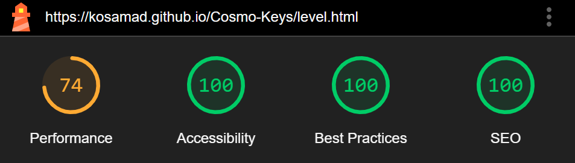

<h1 align="center">Cosmo Keys-Testing</h1>

[View the live website here - Cosmo Keys](https://kosamad.github.io/Cosmo-Keys/)

---

<h2>Contents</h2>

---

Whilst building the game, I continuously used Chrome developer tools to test my pages for responsiveness to different screen sizes and to troubleshoot any problems that arose, using a systematic approach to find and fix issues.

I specifically used the console to log and monitor javascript code which assited me to problem solve aspects of the game which wern't working as expected. 

---

## Automated Testing

### W3C Validator

[W3C](https://validator.w3.org/) was used to validate the HTML on each game page. 

Please note that the error messages which relate to a "Trailing slash on void elements" have been filtered as they are automatically added by the browser and are not a true error (as advised by the CI tutors).

- [index.html](testing/images/validation/index.html-validated.PNG) - passed
- [level.html](testing/images/validation/level.html-validated.PNG) - passed
- [game.html](testing/images/validation/game.html-validated.PNG) - passed

CSS was validated using [W3C Jigsaw](https://jigsaw.w3.org/css-validator/validator).

- [style.css](testing/images/validation/css-validated.PNG) - passed 

Please note, warnings relate to the vendor extensions and can be ignored.

---

### JavaScript Validator

[jshint](https://jshint.com/) was used to validate the JavaScript.

- [cosmo-index.js](testing/images/validation/index-js-valid.PNG) - passed
- [cosmo-level.js](testing/images/validation/level-js-valid.PNG) - passed
- [cosmo-game.js](testing/images/validation/game-js-valid.PNG) - passed

Please note, warnings relate the use of ES6 and are acceptable for the parameters of this project. 

---

### Lighthouse

Lighthouse (a Chrome Developer tool) was used to test the performance, quality and correctness of Cosmo Keys on a desktop.

All pages score poorly for performance. Improvements could be made by eliminating render-blocking resources caused from external styling and removing unused JavaScript (separating Bootstraps bundle). Also, separating my CSS into separate files to minimise what is loaded on each page (e.g the index page does not need the css for the game play page).

---

## Manual Testing

The website was viewed on Chrome, Internet Explorer, Microsoft Edge and Firefox to check the view was consistent between browsers. It was also viewed on a desktop, mobile (pixel5 and iphone8) and a Levona tablet.